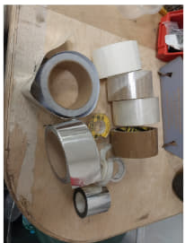
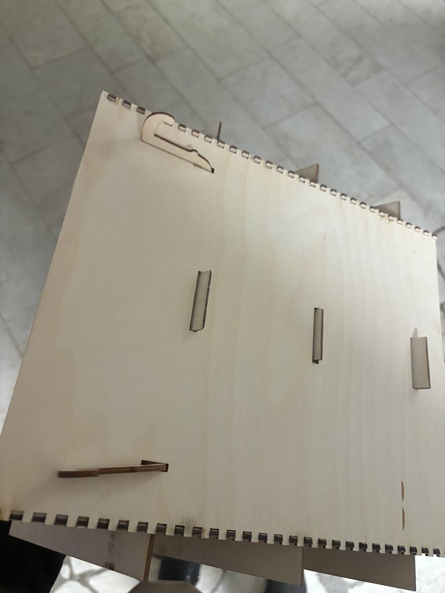
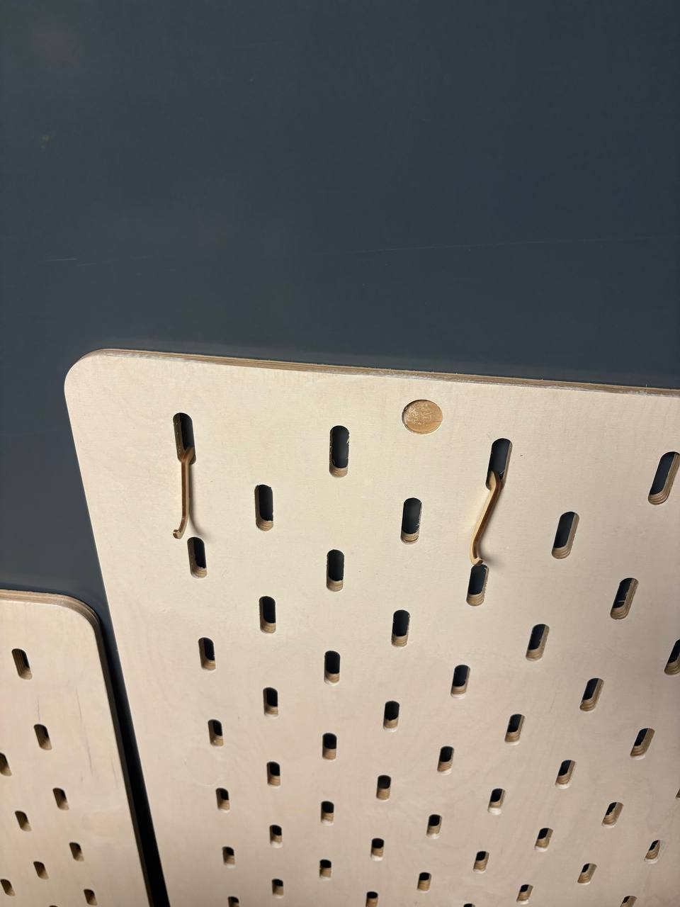
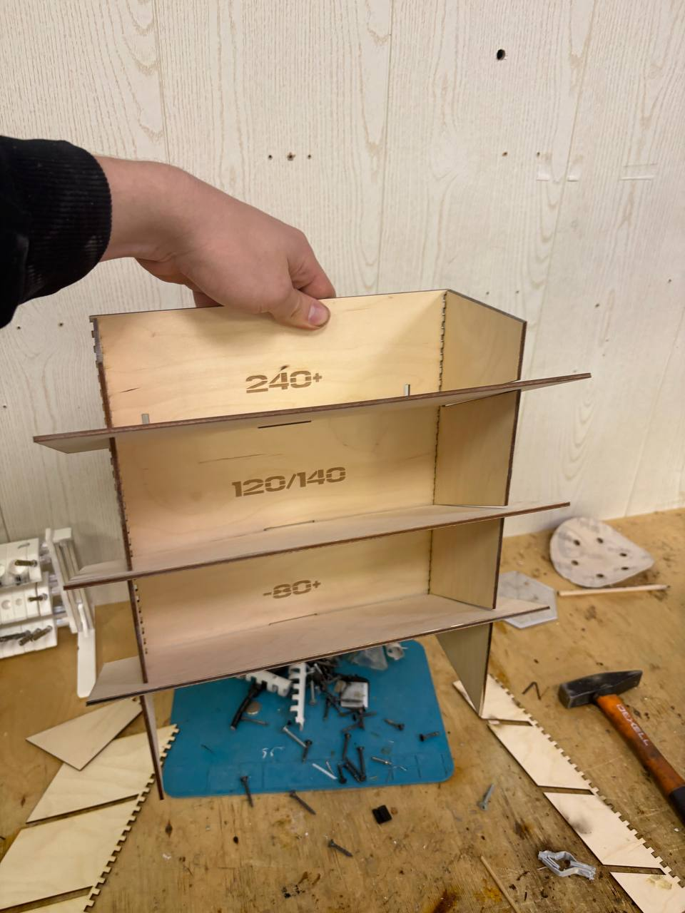

# ОТЧЕТ ПО АРГОНАЙЗЕРАМ  
## ПРАКТИКА НИТУ МИСИС МОРОЗОВ

## 📋 ЗАДАНИЕ
**Создать 3 органайзера для нового стенда для инструментов**

### Типы органайзеров:

#### 1. Органайзер для пачек хамутов

#### 2. Органайзер для наждачной бумаги и наждачных кругов  

#### 3. Органайзер для скотча и клейкой ленты  

## 🛠 МАТЕРИАЛЫ И ТЕХНОЛОГИИ
- **Rhino 8** - 3D моделирование
- **CorelDRAW 2022** - подготовка векторной графики
- **Фанера 3 мм** - основной материал
- **Клей** - сборка конструкции

## 📝 ХОД РАБОТЫ

### 1. Проектирование в Rhino 8
Разработаны 3D модели всех трех типов органайзеров с учетом:
- Габаритных размеров инструментов
- Удобства доступа и извлечения
- Эргономики размещения на стенде
- Оптимального использования пространства  
(Все итоговые файлы в папке files по каждому органайзеру)

### 2. Подготовка в CorelDRAW 2022
Выполнена векторная подготовка моделей для лазерной резки:
- Оптимизация контуров реза
- Расположение деталей на листе фанеры
- Настройка параметров резки под материал 3 мм

### 3. Лазерная резка
Все детали органовйзеров вырезаны на станке лазерной резки:
- Высокая точность исполнения
- Чистые кромки без сколов
- Соответствие проектным размерам  

### 4. Сборка конструкций
Органайзеры собраны с использованием клея:
- Прочная фиксация всех соединений
- Стабильность конструкции под нагрузкой
- Эстетичный внешний вид

## ✅ РЕЗУЛЬТАТЫ

Результаты тестирования и исследования:  

### Достигнутые цели:
- ✅ Создано 3 типа органайзеров для разных категорий инструментов
- ✅ Обеспечено удобное хранение и быстрый доступ к инструментам
- ✅ Оптимизировано пространство стенда
- ✅ Все конструкции устойчивы и функциональны

### Особенности реализации:
- **Материал**: фанера 3 мм
- **Технология**: лазерная резка + клеевая сборка
- **Эргономика**: продуманный дизайн для удобства использования
- **Универсальность**: подходит для различных типов инструментов

## 🎯 ИТОГ

В рамках практики успешно разработаны и изготовлены три специализированных органайзера для организации рабочего пространства на инструментальном стенде. Все конструкции демонстрируют высокую функциональность и соответствуют поставленным задачам.

---

*Проект выполнен в рамках учебной практики НИТУ МИСИС*